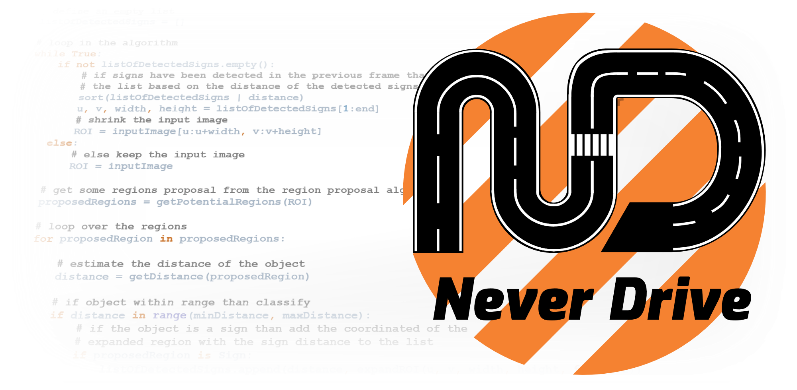
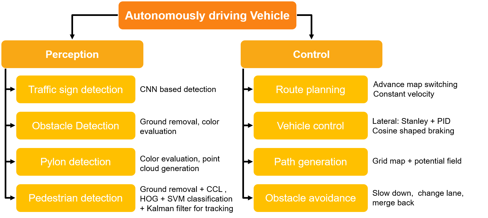
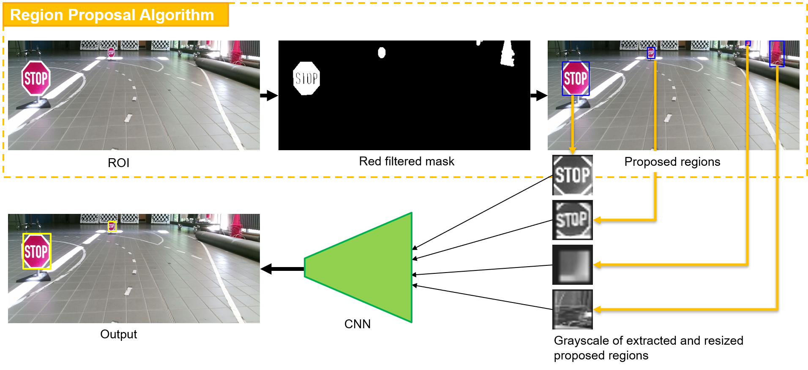
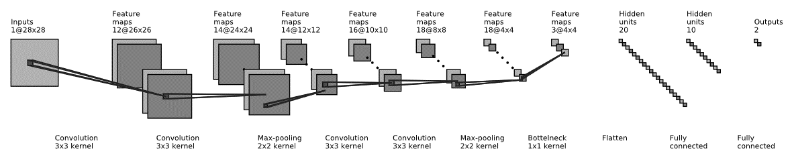
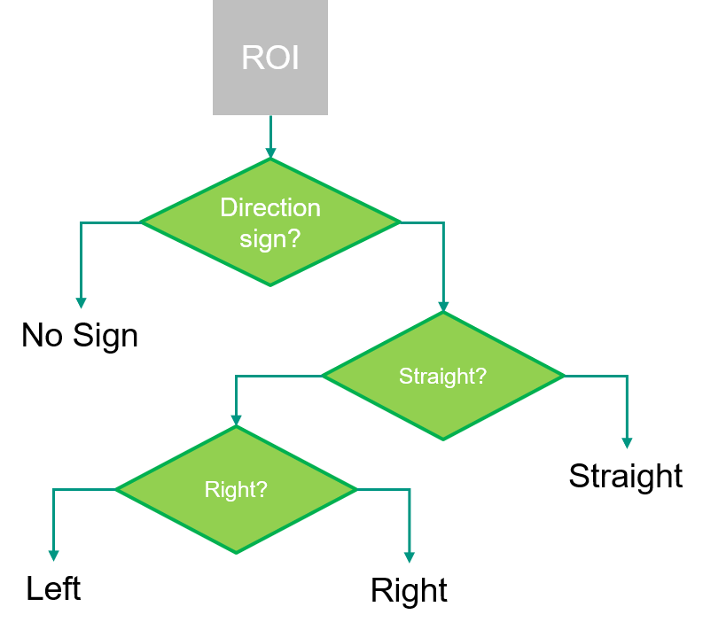

# Cognitive Automotive Lab. 2019

This software is our proposed solution for the Cognitive Automotive Lab organized by the Institute of Measurement and Control Systems (MRT) at Karlsruhe Institute of Technology (KIT) 

## Structure
The software is composed of two main parts. A perception part, which aims to process RGBD images captured with a Microsoft Kinect 2 sensor. The second part of the code is: control. The subtasks of each part are illustrated in the following graphic. 

## Trafic signs detection
To increase the processing speed our group decided to not use the known detection algorithms like tiny YOLO ... but to create a task-specific solution, which can fulfill the requirements at high speed. The following graphic illustrates the detection of stop signs. Hier, a color-based region proposal in combination with a convolutional neural network (CNN) for the classification have been used.

### Convolutional Neural Network
The following graphic shows the structure of the used CNN. The CNN is composed of 4 convolutional layers, 2 pooling layers, one bottleneck layer, and 3 fully connected layers. The total number of trainable parameters is 7557. The training is done with around a dozen thousand images.

The following animated GIF shows the stop sign detection is action.

  

### Dynamic Region Of Interest
One key feature, which made such high frames per second (fps) rate possible is the implementation of what we call "dynamic" region of interest (ROI). The idea behind the dynamic ROI is very simple: Shrinking the ROI of the next frame to the region around the currently detected sign. Once no sign is detected, the ROI expands back to the original size. The dynamic ROI is demonstrated in the following GIF.

  

### Arrow Traffic Sign
A part of the traffic sign detection task is the detection of arrow traffic signs. For this task 4 possible detection outputs are possible: 1)no sign 2)straight 3) right 4) left. For this task, a tree of 3 CNN networks as illustrated in the following graphic have been used. The main advantages of this structure are

* The ability to use the same data to train the tree small networks
* The fast processing of false proposed regions, as we don't need to go all the way through a complex network with four outputs.

  

## Obstacle Avoidance
The obstacle detection algorithm performs as follows:

* Apply ground removal using a contrast image
* Selecting ROI based on a depth range
* Use morphology to remove noise and smooth the contours
* Extracting bounding box of obstacles from ROI
* Evaluating the corresponding ROI in the color image to estimate if the detected object is an obstacle
* Returning the position of the obstacle

The position of the obstacle is then evaluated to determine whether it interferes with the planned path. In the case of interference, the path is re-planed to avoid the obstacle. The following GIF demonstrates the algorithm.

  

## Navigation in Unknown Environments
In regions where positioning is not possible, an autonomous driving vehicle should be able to safely navigate. This scenario is simulated through pillons, which the vehicle has to navigate through. This problem is solved in the following steps:

* Synchronize and resize depth and color images
* Distinguish pylon and ground in color image
* Match pixels between depth and color image (stereo vision)
* Generate points cloud and transform it to world coordinate
* Project points cloud to Occupancy Grid Map and use Bayes rule to do the iteration
* Generate path incrementally dependent on end point direction of current path
* Search a lateral range in the forward direction of end point
* Use potential field method to find the point with the lowest potential energy in lateral range

  

